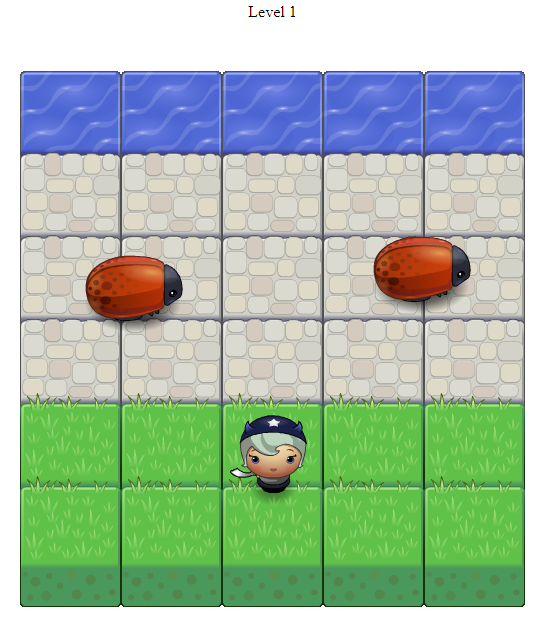

# frontend-nanodegree-arcade-game
 

## Basic Functionality
In this game you have a Player and Enemies (bugs). The goal of the player is to reach the water, without colliding into any one of the enemies.

* The enemies move at varying speeds on the paved block portion of the game board
* Once a the player collides with an enemy, the game is reset and the player moves back to the starting square
* Once the player reaches the water (i.e., the top of the game board), the game is won.
* Enjoy the game.
## Click [Arcade Game App](https://danrejsa.github.io/Memory-Game/) to play the game.

## ScreenShot

